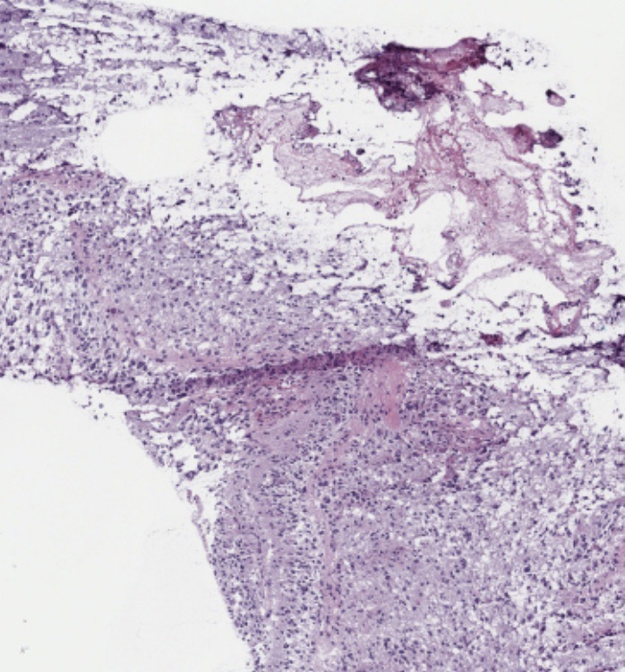
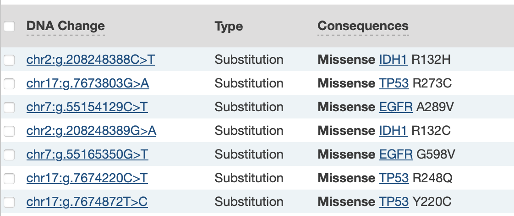
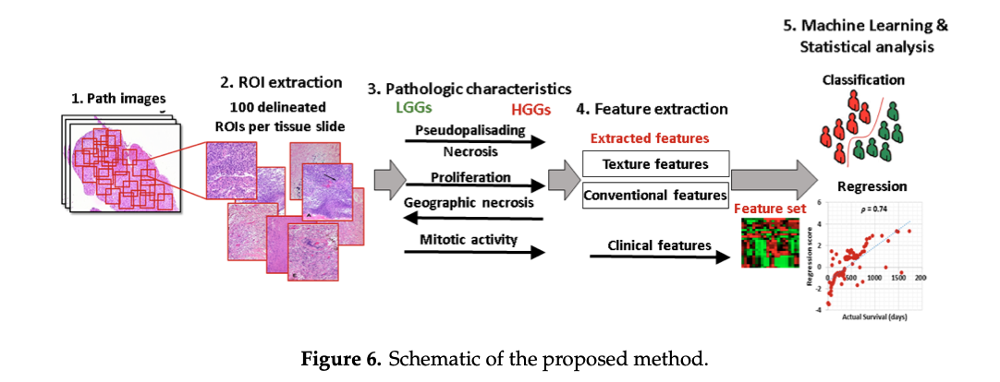
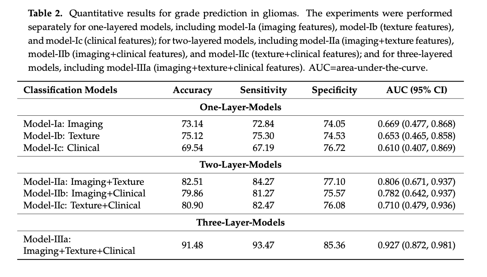
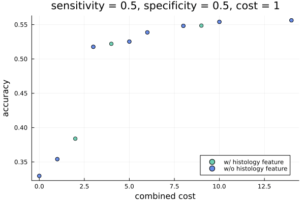

```@meta
EditURL = "GliomaGrading.jl"
```

# [Cost-Efficient Experimental Design Towards Glioma Grading](@id glioma_grading)

Gliomas are the most common primary tumors of the brain. They can be graded as LGG (Lower-Grade Glioma) or GBM (Glioblastoma Multiforme), depending on the histological and imaging criteria. Clinical and molecular or genetic factors are also very crucial for the grading process. The ultimate aim is to identify the optimal subset of clinical, molecular or genetic, and histological features for the glioma grading process to improve diagnostic accuracy and reduce costs.

Case [_TCGA-HT-8564_](https://portal.gdc.cancer.gov/cases/f625e522-226b-450f-af94-dd2f5adb605e?filters=%7B%22content%22%3A%5B%7B%22content%22%3A%7B%22field%22%3A%22cases.project.project_id%22%2C%22value%22%3A%5B%22TCGA-LGG%22%5D%7D%2C%22op%22%3A%22in%22%7D%5D%2C%22op%22%3A%22and%22%7D), diagnosis _Astrocytoma, anaplastic_:

```@raw html

```

## Theoretical Framework

Let us consider a set of $n$ experiments $E = \{ e_1, \ldots, e_n\}$.

For each subset $S \subseteq E$ of experiments, we denote by $v_S$ the value of information acquired from conducting experiments in $S$.

In the cost-sensitive setting of CEEDesigns, conducting an experiment $e$ incurs a cost $(m_e, t_e)$. Generally, this cost is specified in terms of monetary cost and execution time of the experiment.

To compute the cost associated with carrying out a set of experiments $S$, we first need to introduce the notion of an arrangement $o$ of the experiments $S$. An arrangement is modeled as a sequence of mutually disjoint subsets of $S$. In other words, $o = (o_1, \ldots, o_l)$ for a given $l\in\mathbb N$, where $\bigcup_{i=1}^l o_i = S$ and $o_i \cap o_j = \emptyset$ for each $1\leq i < j \leq l$.

Given a subset $S$ of experiments and their arrangement $o$, the total monetary cost and execution time of the experimental design is given as $m_o = \sum_{e\in S} m_e$ and $t_o = \sum_{i=1}^l \max \{ t_e : e\in o_i\}$, respectively.

For instance, consider the experiments $e_1,\, e_2,\, e_3$, and $e_4$ with associated costs $(1, 1)$, $(1, 3)$, $(1, 2)$, and $(1, 4)$. If we conduct experiments $e_1$ through $e_4$ in sequence, this would correspond to an arrangement $o = (\{ e_1 \}, \{ e_2 \}, \{ e_3 \}, \{ e_4 \})$ with a total cost of $m_o = 4$ and $t_o = 10$.

However, if we decide to conduct $e_1$ in parallel with $e_3$, and $e_2$ with $e_4$, we would obtain an arrangement $o = (\{ e_1, e_3 \}, \{ e_2, e_4 \})$ with a total cost of $m_o = 4$, and $t_o = 3 + 4 = 7$.

Given the constraint on the maximum number of parallel experiments, we devise an arrangement $o$ of experiments $S$ such that, for a fixed tradeoff between monetary cost and execution time, the expected combined cost $c_{(o, \lambda)} = \lambda m_o + (1-\lambda) t_o$ is minimized (i.e., the execution time is minimized).

In fact, it can be readily demonstrated that the optimal arrangement can be found by ordering the experiments in set $S$ in descending order according to their execution times. Consequently, the experiments are grouped sequentially into sets whose size equals to the maximum number of parallel experiments, except possibly for the final set.

Continuing our example and assuming a maximum of two parallel experiments, the optimal arrangement is to conduct $e_1$ in parallel with $e_2$, and $e_3$ with $e_4$. This results in an arrangement $o = (\{ e_1, e_2 \}, \{ e_3, e_4 \})$ with a total cost of $m_o = 4$ and $t_o = 2 + 4 = 6$.

Assuming the information values $v_S$ and optimized experimental costs $c_S$ for each subset $S \subseteq E$ of experiments, we then generate a set of cost-efficient experimental designs.

### Application to Predictive Modeling

Consider a dataset of historical readouts over $m$ features $X = \{x_1, \ldots, x_m\}$, and let $y$ denote the target variable that we want to predict.

We assume that each experiment $e \in E$ yields readouts over a subset $X_e \subseteq X$ of features.

Then, for each subset $S \subseteq E$ of experiments, we may model the value of information acquired by conducting the experiments in $S$ as the accuracy of a predictive model that predicts the value of $y$ based on readouts over features in $X_S = \bigcup_{e\in S} X_e$.

## Glioma Grading Clinical and Mutation Dataset

In this dataset, the instances represent patient records of those diagnosed with brain glioma. The dataset is publicly available at [Glioma Grading Clinical and Mutation Features](https://archive.ics.uci.edu/dataset/759/glioma+grading+clinical+and+mutation+features+dataset). It is constructed based on the TCGA-LGG and TCGA-GBM brain glioma projects available at the [NIH GDC Data Portal](https://portal.gdc.cancer.gov).

Each record is characterized by

- 3 clinical features (age, gender, race),
- 5 mutation factors (IDH1, TP53, ATRX, PTEN, EGFR; each of which can be 'mutated' or 'not_mutated').

We list somatic mutations with the highest number of affected cases in cohort:



We load the dataset:

````@example GliomaGrading
using CSV, DataFrames
data = CSV.File("data/glioma_grading.csv") |> DataFrame
data[1:5, :]
````

## Assessing the Predictive Accuracy

We specify the clinical features and mutation factors.

````@example GliomaGrading
features_clinical = ["Age_at_diagnosis", "Gender", "Race"]
````

````@example GliomaGrading
features_mutation = ["IDH1", "TP53", "ATRX", "PTEN", "EGFR", "CIC", "MUC16"]
````

The classification target is the glioma grade.

````@example GliomaGrading
target = "Grade"
````

In the cost-sensitive setting of CEEDesigns, obtaining additional experimental evidence comes with a cost. We assume that each gene mutation factor is obtained through a separate experiment.

````@example GliomaGrading
experiments = Dict(
    # experiment => cost => features
    "TP53" => 3.0 => ["TP53"],
    "EGFR" => 2.0 => ["EGFR"],
    "PTEN" => 4.0 => ["PTEN"],
    "ATRX" => 2.0 => ["ATRX"],
    "IDH1" => 3.0 => ["IDH1"],
    "CIC" => 1.0 => ["CIC"],
    "MUC16" => 2.0 => ["MUC16"],
)
````

### Classifier

We use [MLJ.jl](https://alan-turing-institute.github.io/MLJ.jl/dev/) to evaluate the predictive accuracy over subsets of experimental features.

````@example GliomaGrading
using MLJ
import BetaML, MLJModels
using Random: seed!
````

We fix the scientific types of the features.

````@example GliomaGrading
types = Dict(
    name => Multiclass for name in [Symbol.(features_mutation); :Grade; :Gender; :Race]
)
data_typefix = coerce(data, types)
schema(data_typefix)
````

We list all models compatible with the dataset:

````@example GliomaGrading
models(matching(data_typefix, data_typefix[:, target]))
````

We fix `RandomForestClassifier` from [BetaML](https://github.com/sylvaticus/BetaML.jl).

````@example GliomaGrading
classifier = @load RandomForestClassifier pkg = BetaML verbosity = -1
model = classifier(; n_trees = 8, max_depth = 5)
````

### Cost-Efficient Feature Selection

We use `evaluate_experiments` from `CEEDesigns.StaticDesigns` to evaluate the predictive accuracy over subsets of experiments. We use `LogLoss` as a measure of accuracy. It is possible to pass additional keyword arguments, which will be forwarded to `MLJ.evaluate` (such as `measure`, shown below).

````@example GliomaGrading
using CEEDesigns, CEEDesigns.StaticDesigns

seed!(1) # evaluation process generally is not deterministic
perf_eval = evaluate_experiments(
    experiments,
    model,
    data_typefix[!, Not(target)],
    data_typefix[!, target];
    zero_cost_features = features_clinical,
    measure = LogLoss(),
    resampling = CV(; nfolds = 10),
)
````

We proceed to construct the set of cost-efficient experimental designs. In doing so, our goal is to identify the optimal sets of mutation factors for the glioma grading task, balancing the conflicting objectives of enhancing prediction accuracy and reducing incurred costs.

````@example GliomaGrading
designs = efficient_designs(experiments, perf_eval)
plot_front(designs; labels = make_labels(designs), ylabel = "logloss")
````

## Assessing the Impact of Histopathology Image Analysis on the Experimental Cost-Efficiency

Building on the previous example, we will consider the introduction of a new feature in the task of glioma grading, where this feature will essentially function as a predictor of the glioma grade.

In [Glioma Grading via Analysis of Digital Pathology Images Using Machine Learning](https://www.ncbi.nlm.nih.gov/pmc/articles/PMC7139732/), the authors proposed a computational method that exploits pattern analysis methods for grade prediction in gliomas using digital pathology images.

From the abstract, _according to the remarkable performance of computational approaches in the digital pathology domain, we hypothesized that machine learning can help to distinguish low-grade gliomas (LGG) from high-grade gliomas (HGG) by exploiting the rich phenotypic information that reflects the microvascular proliferation level, mitotic activity, presence of necrosis, and nuclear atypia present in digital pathology images. A set of 735 whole-slide digital pathology images of glioma patients (median age: 49.65 years, male: 427, female: 308, median survival: 761.26 days) were obtained from TCGA. Sub-images that contained a viable tumor area, showing sufficient histologic characteristics, and that did not have any staining artifact were extracted. Several clinical measures and imaging features, including conventional (intensity, morphology) and advanced textures features (gray-level co-occurrence matrix and gray-level run-length matrix), extracted from the sub-images were further used for training the support vector machine model with linear configuration._



The authors aimed to evaluate the combined effect of conventional imaging, clinical, and texture features by assessing the predictive value of each feature type and their combinations through a predictive classifier.

For our specific intent, we will focus on the predictive accuracy of a classifier that utilizes only imaging features.



We will artificially produce the grade predictions, modelling them as predictor outputs with the defined sensitivity and specificity. Note that we will not incorporate any further correlations with other features such as clinical factors, mutation factors, or histology.

In addition, we consider the cost of the predictive classifier development.

````@example GliomaGrading
sensitivity = 0.73
specificity = 0.74
cost = 1.0
````

We simulate a predictor with the given sensitivity and specificity.

````@example GliomaGrading
function predict(
        X;
        positive_label = 1,
        negative_label = 0,
        sensitivity::Float64,
        specificity::Float64,
    )
    y_pred = similar(X, Union{typeof(positive_label), typeof(negative_label)})
    for i in eachindex(X)
        if X[i] == positive_label
            y_pred[i] = rand() < sensitivity ? positive_label : negative_label
        else
            y_pred[i] = rand() < (1 - specificity) ? positive_label : negative_label
        end
    end
    return y_pred
end

seed!(1)
digital_pathology = map(
    x -> x == "LGG" ? "lower grade" : "glioblastoma",
    predict(
        data_typefix[!, target];
        positive_label = "GBM",
        negative_label = "LGG",
        sensitivity,
        specificity,
    ),
)
````

We add the new feature to the dataset:

````@example GliomaGrading
experiments_new_feature =
    push!(copy(experiments), "digital_pathology" => cost => ["digital_pathology"])
````

````@example GliomaGrading
data_new_feature = copy(data_typefix)
data_new_feature.digital_pathology = digital_pathology

data_new_feature_typefix = coerce(
    data_new_feature,
    Dict(
        (
            name => Multiclass for
                name in [Symbol.(features_mutation); :Grade; :Gender; :Race]
        )...,
        :digital_pathology => Multiclass,
    ),
)

first(data_new_feature_typefix, 5)
````

We evaluate performance measures across different experimental subsets, comparing those that include the histology feature and those that do not.

````@example GliomaGrading
seed!(1)
perf_eval_new_feature = evaluate_experiments(
    experiments_new_feature,
    model,
    data_new_feature_typefix[!, Not(target)],
    data_new_feature_typefix[!, target];
    zero_cost_features = features_clinical,
    measure = LogLoss(),
    resampling = CV(; nfolds = 10),
)
````

We construct the set of cost-efficient experimental designs, comparing the frontier that incorporates the histology feature with the one that does not.

````@example GliomaGrading
using Plots

experiments_new_feature_no_feature = copy(experiments_new_feature)
delete!(experiments_new_feature_no_feature, "digital_pathology")

seed!(1)
perf_eval_new_feature_no_feature = evaluate_experiments(
    experiments_new_feature_no_feature,
    model,
    data_new_feature_typefix[!, Not(target)],
    data_new_feature_typefix[!, target];
    zero_cost_features = features_clinical,
    measure = LogLoss(),
    resampling = CV(; nfolds = 10),
)

for (k, v) in perf_eval_new_feature_no_feature
    perf_eval_new_feature[k] = v
end

design_new_feature = efficient_designs(experiments_new_feature, perf_eval_new_feature)

design_new_feature_no_feature =
    efficient_designs(experiments_new_feature_no_feature, perf_eval_new_feature_no_feature)

p_new_feature = scatter(
    map(x -> x[1][1], design_new_feature),
    map(x -> 1 - x[1][2], design_new_feature);
    xlabel = "combined cost",
    ylabel = "accuracy",
    label = "w/ histology feature",
    c = CEEDesigns.colorant"rgb(110,206,178)",
    mscolor = nothing,
    fontsize = 16,
    fillalpha = 0.2,
    legend = :bottomright,
)

scatter!(
    p_new_feature,
    map(x -> x[1][1], design_new_feature_no_feature),
    map(x -> 1 - x[1][2], design_new_feature_no_feature);
    label = "w/o histology feature",
    c = CEEDesigns.colorant"rgb(104,140,232)",
    mscolor = nothing,
    fontsize = 16,
    fillalpha = 0.15,
    title = "sensitivity = $sensitivity, specificity = $specificity, cost = $cost",
)
````

The following illustration demonstrates the efficient frontiers generated for a range of predictive model parameters.



