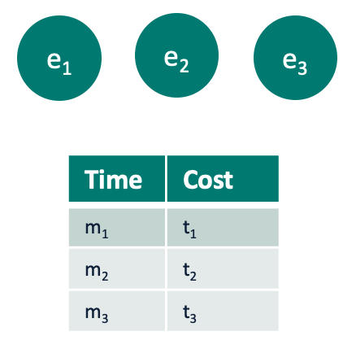
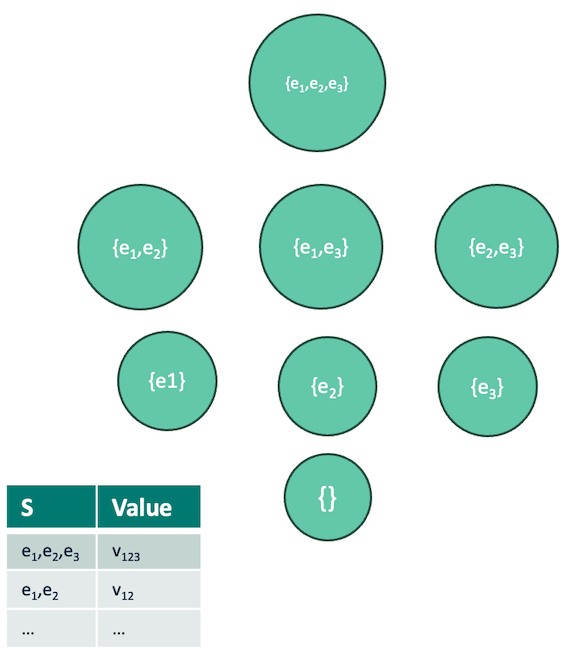
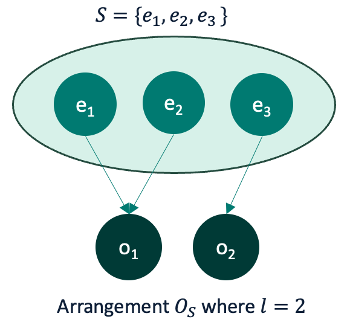

```@meta
EditURL = "SimpleStatic.jl"
```

# Static Experimental Designs

In this document we describe the theoretical background behind the tools in CEEDesigns.jl for producing optimal "static experimental designs",
arrangements of experiments that exist along a Pareto-optimal tradeoff between cost and information gain.

## Setting

Consider the following scenario. There exists a set of experiments, each of which, when performed, yields
measurements on one or more observables (features). Each subset of observables (and therefore each subset of experiments)
has some "information value", which is intentionally vaguely defined for generality, but for example, may be
a loss function if that subset is used  to train some machine learning model. It is generally the value of acquiring that information.
Finally, each experiment has some monetary cost and execution time to perform the experiment, and
the user has some known tradeoff between overall execution time and cost.

CEED.jl provides tools to take these inputs and produce a set of optimal "arrangements" of experiments for each
subset of experiments that form a Pareto front along the tradeoff between information gain and total combined cost
(monetary and time). This allows informed decisions to be made, for example, regarding how to allocate scarce
resources to a set of experiments that attain some acceptable level of information (or, conversely, reduce
uncertainty below some level).

The arrangements produced by the tools introduced in this tutorial are called "static" because they implicitly
assume that future data will have exactly the information gain of each experiment as the "historical" input.

This tutorial introduces the theoretical framework behind static experimental designs with synthetic data.
For examples using real data, please see our other tutorials.

## Theoretical Framework

### Experiments

Let $E = \{ e_1, \ldots, e_n\}$ be a set of $n$ experiments (i.e., $|E|=n$). Each experiment $e \in E$ has an
associated tuple $(m_{e},t_{e})$, giving the monetary cost and time duration required to perform experiment $e$.



Consider $P(E)$, the power set of experiments (i.e., every possible subset of experiments). Each subset of
experiments $S\in P(E)$ has an associated value $v_{S}$, which is the value of the experiments contained in $S$.
This may be given by the loss function associated with a prediction task where the information yielded from $S$
is used as predictor variables, or some other notion of information value.



### Arrangements

If experiments within a subset $S$ can be performed simultaneously (in parallel), then each $S$ may be arranged
optimally with respect to time. An arrangement $O_{S}$ of $S$ is a partition of the experiments in $S$ such that
the size of each partition is not larger than the maximum number of experiments that may be done in parallel.

Let $l$ be the number of partitions, and $o_{i}$ a partition in $O_{S}$. Then the arrangement is a surjection from $S$
onto $O_{S}$. If no experiments can be done in parallel, then $l=|S|$. If all experiments are done in parallel, then
$l=1$. Other arrangements fall between these extremes.



### Optimal Arrangements

To find the optimal arrangement for each $S$ we need to know the cost of $O_{S}$. The monetary cost of $O_{S}$ is simply
the sum of the costs of each experiment:
$$m_{O_{S}}=\sum_{e\in S} m_{e}$$
The total time required is the sum of the maximum time *of each partition*. This is because while each partition in the
arrangement is done in serial, experiments within partitions are done in parallel.
$$t_{O_{S}}=\sum_{i=1}^{l} \text{max} \{ t_{e} e \in o_{i}\}$$
Given these costs and a parameter $\lambda$ which controls the tradeoff between monetary cost and time, the combined
cost of an arrangement is:
$$\lambda m_{O_{S}} + (1-\lambda) t_{O_{S}}$$

For instance, consider the experiments $S = \{e_{1},e_{2},e_{3},e_{4}\}$, with associated costs $(1, 1)$, $(1, 3)$, $(1, 2)$, and $(1, 4)$.
If we conduct experiments $e_1$ through $e_4$ in sequence, this would correspond to an arrangement
$O_{S} = (\{ e_1 \}, \{ e_2 \}, \{ e_3 \}, \{ e_4 \})$ with a total cost of $m_{O_{S}} = 4$ and $t_{O_{S}} = 10$.

However, if we decide to conduct $e_1$ in parallel with $e_3$, and $e_2$ with $e_4$, we would obtain an arrangement
$O_{S} = (\{ e_1, e_3 \}, \{ e_2, e_4 \})$ with a total cost of $m_{O_{S}} = 4$, and $t_{O_{S}} = 3 + 4 = 7$.

Continuing our example and assuming a maximum of two parallel experiments, the optimal arrangement is to conduct
$e_1$ in parallel with $e_2$, and $e_3$ with $e_4$. This results in an arrangement $O_{S} = (\{ e_1, e_2 \}, \{ e_3, e_4 \})$ with a total cost of $m_o = 4$ and $t_o = 2 + 4 = 6$.

In fact, it can be readily demonstrated that the optimal arrangement can be found by ordering the experiments in
S in descending order according to their execution times. Consequently, the experiments are grouped sequentially
into partitions whose size equals the maximum number of parallel experiments, except possibly for the final set,
if the maximum number of parallel experiments does not divide $S$ evenly.

## Synthetic Data Example

First we load necessary packages.

````@example SimpleStatic
using CEEDesigns, CEEDesigns.StaticDesigns
using Combinatorics: powerset
using DataFrames
using POMDPs, POMDPTools, MCTS
````

This tutorial presents a synthetic example of using CEED to optimize static experimental design.
We consider a situation where there are 3 experiments, and we draw a value of their "loss function"
or "entropy" from the uniform distribution on the unit interval for each.

For each $S\in P(E)$, we simulate the information value ($v_{S}$) of $S$ as the product of
the values for each individual experiment.
Therefore, because smaller values are better, any subset containing multiple experiments is guaranteed to be
more "valuable" than any component experiment.

````@example SimpleStatic
experiments = ["e1","e2","e3"];
experiments_val = Dict([e => rand() for e in experiments]);

experiments_evals = Dict(
    map(Set.(collect(powerset(experiments)))) do s
        if length(s) > 0
            s => prod([experiments_val[i] for i in s])
        else
            return s => 1.0
        end
    end
);
nothing #hide
````

Better experiments are more costly, both in terms of time and monetary cost. We print
the data frame showing each experiment and its associated costs.

````@example SimpleStatic
experiments_costs = Dict(
    sort(collect(keys(experiments_val)), by=k->experiments_val[k], rev=true) .=> tuple.(1:3,1:3)
);

DataFrame(
    experiment=collect(keys(experiments_costs)),
    time=getindex.(values(experiments_costs),1),
    cost=getindex.(values(experiments_costs),2)
)
````

We can plot the experiments ordered by their "loss function".

````@example SimpleStatic
plot_evals(experiments_evals; f = x->sort(collect(keys(x)), by = k->x[k], rev=true), ylabel = "loss")
````

We print the data frame showing each subset of experiments and its overall loss value.

````@example SimpleStatic
DataFrame(
    S=collect.(collect(keys(experiments_evals))),
    value=collect(values(experiments_evals))
)
````

Now we are ready to find the subsets of experiments giving an optimal tradeoff between information
value and combined cost (where we use $\lambda=0.5$). CEED exports a function `efficient_designs`
which formulates the problem of finding optimal arrangements as a Markov Decision Process and solves
optimal arrangements for each subset on the Pareto frontier.

Note that because we set the maximum number of parallel experiments equal to 2, the complete subset
of experiments groups the experiments with long execution times together (see plot legend; each group/partition is
prefixed with a number).

````@example SimpleStatic
max_parallel = 2;
tradeoff = (0.5, 0.5);

designs = efficient_designs(experiments_costs, experiments_evals, max_parallel=max_parallel, tradeoff=tradeoff);

plot_front(designs; labels = make_labels(designs), ylabel = "loss")
````

