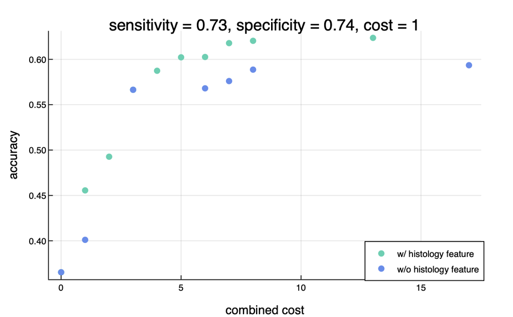
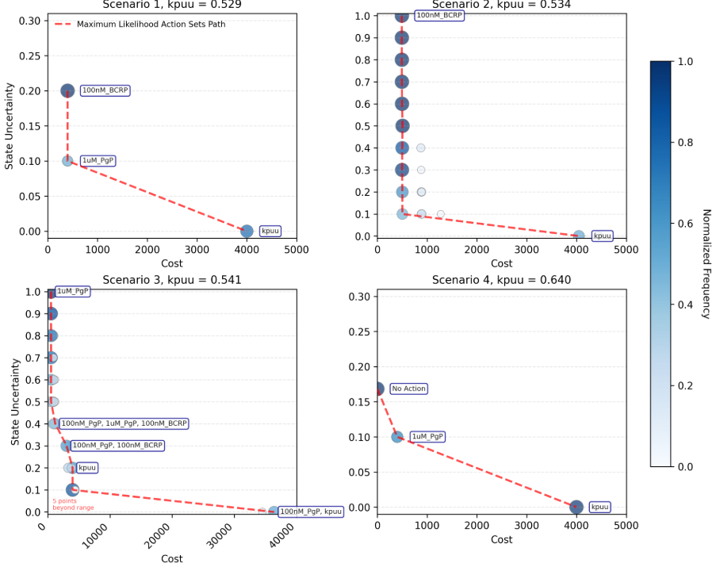

# Summary

`CEEDesigns.jl` is a Julia package for cost-efficient design of experiments. A design consists of one or more experiments; each experiment is an action to acquire additional empirical evidence which incurs a monetary cost and time to execute. Given a set of experiments and historical results, `CEEDesigns.jl` solves for the Pareto-efficient front of designs that balance the value of the evidence they yield against the execution cost they incur.

To find efficient designs for a population of experimental entities, `CEEDesigns.jl` implements two design regimes. The *static* regime fixes one design for an entire population. It estimates the information value of each possible design from the cross-validated performance of a predictive model trained with `MLJ.jl` [@blaom2020mlj], then schedules the chosen subset to minimize execution cost. The *dynamic* regime builds a design one experiment at a time for a single entity. Selection of the next experiment is conceived of as a Markov decision process [@egorov2017pomdps]. Each iteration simulates an experimental run, updates beliefs about unobserved outcomes, and accumulates costs. The design is solved online with Monte Carlo tree search [@browne2012; @mcts_jl].

Both regimes learn what they need directly from historical data: a predictive model in the static case, a similarity-weighted resampling of past data in the dynamic one. Neither requires a mechanistic simulator. `CEEDesigns.jl` was developed for assay triage optimization in drug discovery [@chen2026], but applies in any domain where experiments incur real costs, historical analogs are available, and resources must be spent to reduce uncertainty to an acceptable level.

# Statement of Need

In drug discovery, thousands of candidates advance through iterative cycles of design, synthesis, and testing to find promising pre-clinical candidates. During testing, compounds are evaluated for potency, bioavailibilty, safety, and other features on assays that span orders of magnitude in cost and predictiveness, from \$100-scale *in vitro* readouts to definitive *in vivo* endpoints costing thousands of dollars and several weeks [@segall2012]. Resource constraints reframe the operative question from *can we fully characterize this candidate?* To *what is the smallest experimental sequence that resolves the decision at proportionate cost?*

Assay triage for compounds occurs continuously: beliefs must be updated as each readout arrives, correlation among assays exploited, downstream consequences of each choice anticipated, and total spend justified against information gained. In practice, scientists rely on inflexible rules, leading to policies that tend to be risk-averse or short-horizon, leaving avoidable cost on the table.

`CEEDesigns.jl` recasts this triage as a decision problem and delivers it as a Julia package, aimed at computational chemists, assay scientists, and decision-science teams who must prioritize experiments under tight budgets. The same abstractions transfer to any setting where measurements are costly, historical analogs exist, and no mechanistic simulator is available.

# State of the Field

The cost-aware, evidence-adaptive triage problem draws on several mature literatures. Bayesian experimental design (BED) selects experiments that maximize expected information gain [@chaloner1995; @rainforth2024; @egbomeier2024], but most canonical methods are *myopic* and presume an explicit likelihood or simulator; extensions to implicit likelihoods [@kleinegesse2020] and amortized policy learning [@foster2021deep; @ivanova2021; @blau2022] relax these assumptions only at the cost of substantial training infrastructure. Bayesian optimization [@shahriari2016], in its standard form, improves a single objective rather than balancing information against resources, and Bayesian reinforcement learning [@ghavamzadeh2015] needs either an explicit (posterior) transition model or sampled interaction trajectories $(s, a, r)$ that pre-clinical triage rarely provides.

On the software side, the Python ecosystem offers `BoTorch` [@balandat2020botorch] and `BoFire` [@bofire2023] for (multi-objective) Bayesian optimization, primarily over Gaussian-process surrogates and including mixed continuous, discrete, and categorical design spaces; `Pyro` [@pyro_oed] additionally ships an explicit Bayesian-optimal-design module (`pyro.contrib.oed`) for expected-information-gain estimation, and general-purpose probabilistic-programming languages such as `PyMC` [@salvatier2016pymc] can express BED objectives, though they provide no dedicated BED tooling. These tools excel at one-shot or short-horizon optimization, but rely on myopic single-step acquisition: they do not plan multi-step sequences of discrete assays under coupled monetary and time budgets, nor build a similarity-based, simulator-free transition model from historical records.

`CEEDesigns.jl` targets that gap. It models monetary cost and execution time explicitly, plans dynamically over sequences of assays, returns a Pareto frontier rather than a single recommendation, derives its dynamic transition model nonparametrically from historical outcomes, and composes with the established Julia machine-learning and decision-making stack [@blaom2020mlj; @egorov2017pomdps; @mcts_jl].

# Software Design

`CEEDesigns.jl` is a thin composition over the Julia scientific stack [@bezanson2017julia] rather than a reimplementation. A top-level module supplies a shared Pareto-front primitive and plotting helpers for two submodules: `StaticDesigns` and `GenerativeDesigns` for static and dynamic designs, respectively. The two regimes are deliberately built on common parts. Each expresses the value of information as a modular uncertainty measure of a target property, experimental costs by a `(monetary, time)` pair combined under a user-set trade-off, and returns the non-dominated set in the cost–uncertainty plane. Where they conceptually differ is in how the design is *searched*.

In the **static** regime, the value of a measurement subset is the cross-validated predictive performance of an `MLJ.jl` model trained on the corresponding features, evaluated over the powerset of experiments. The chosen subset is then arranged optimally, with a Markov decision process (MDP) entering only afterwards as a heuristic search device for scheduling the already-selected experiments into efficient parallel batches. The static regime also carries an optional *filtration* term: the fraction of entities that survive a screen and proceed to follow-up experiments, which discounts the cost of all downstream work so that a screen eliminating most candidates early is costed accordingly. 

In the **dynamic** regime, by contrast, experiment selection *itself* is the MDP, because the next-best action depends on outcomes not yet observed. The regime's distinguishing choice is a *simulator-free*, nonparametric transition model built directly from a historical `DataFrame`. Each historical row $D_i$ receives a weight $w_i(s) = \exp(-\lambda_w\, d(s, D_i))$ from a similarity kernel applied to a distance $d(s, D_i)$ between the current evidence $s$ and that row; transitions are then simulated by resampling rows in proportion to these weights, recomputed as evidence arrives so that belief concentrates on consistent historical analogs [@chen2026]. The distance is type-aware and configurable, with a Mahalanobis option for correlated features. The MDP is a subtype of `POMDPs.MDP` solved online with Monte Carlo tree search using double progressive widening (`MCTS.jl`).

The dynamic regime exposes three planners that answer three decision framings. To drive overall uncertainty about a single target below an acceptable level at least cost, `UncertaintyReductionMDP` minimizes expected cost subject to a terminal bound on residual uncertainty. To place the target confidently inside or outside a region of interest, `ConditionalUncertaintyReductionMDP` adds a *goal-likelihood* stopping rule that halts once posterior mass in that region crosses a belief threshold, with companion routines aggregating repeated runs to quantify stability. Where there is no fixed uncertainty bar but an explicit, possibly nonlinear utility function, `EfficientValueMDP` optimizes cost of information.

A minimal static design illustrates the surface. Experiments are declared as a mapping from a name to its cost and the features it reveals; the rest composes over `MLJ.jl`, `DataFrames.jl`, `POMDPs.jl`, and `Plots.jl`:

```julia
using CEEDesigns, CEEDesigns.StaticDesigns, MLJ

experiments = Dict(
    "MutationPanel" => (300.0, 5.0) => ["TP53", "EGFR", "PTEN"],
    "Histology"     => (2000.0, 14.0) => ["grade_score"],
)
evals   = evaluate_experiments(experiments, model, X, y; measure = LogLoss())
designs = efficient_designs(experiments, evals; max_parallel = 2, tradeoff = (0.5, 0.5))
```

Tutorials accompany every entry point, from the introductory [`SimpleStatic.jl`](https://github.com/Merck/CEEDesigns.jl/blob/main/tutorials/SimpleStatic.jl) and [`SimpleGenerative.jl`](https://github.com/Merck/CEEDesigns.jl/blob/main/tutorials/SimpleGenerative.jl) to the applied [`GliomaGrading.jl`](https://github.com/Merck/CEEDesigns.jl/blob/main/tutorials/GliomaGrading.jl) and [`ConditionalUncertaintyReduction.jl`](https://github.com/Merck/CEEDesigns.jl/blob/main/tutorials/ConditionalUncertaintyReduction.jl). Full API documentation is maintained in the repository.

# Research Impact

`CEEDesigns.jl` originated within the Dynamics of Value Evolution (DyVE) framework for computational R&D process modeling, alongside the sibling Julia packages `ReactiveDynamics.jl` [@bima2022reactivedynamics] and `AlgebraicAgents.jl` [@bima2026algebraicagents] for hierarchical dynamical-system co-integration. It was presented to the scientific-computing community as a contributed talk at JuliaCon 2024 [@bima2024juliacon], and the underlying methodology is to appear at the European Conference on Machine Learning and Principles and Practice of Knowledge Discovery in Databases (ECML PKDD) 2026 [@bima2026ecml].

Two applications demonstrate the package in use. In a glioma-grading example (low-grade glioma vs. glioblastoma), zero-cost clinical features and separately costed gene-mutation assays feed a classifier; the static Pareto frontier traces classification accuracy against combined cost, with and without an optional digital-pathology endpoint, and the shift between the two upper envelopes reports the endpoint's marginal value as cost per unit of uncertainty reduction (\autoref{fig:glioma}).

{width=70%}

The dynamic regime has been applied operationally at MSD to CNS brain-penetration triage, spanning several modalities—zero-cost QSAR (Quantitative Structure Activity Relationship) predictions, three *in vitro* transporter readouts (P-glycoprotein at two concentrations and BCRP; \$400 and 7 days each), and a definitive *in vivo* $k_{\mathrm{puu}}$ measurement (\$4,000, 21 days)—against a historical cohort of $N = 220$ fully profiled compounds. Across four representative scenarios (\autoref{fig:cns}), the adaptive planner matched or exceeded the rule-based baseline's decision confidence with \$400–\$800 plans, against the baseline's full \$5,200 panel: up to a 92% reduction in assay spend while preserving or improving decision confidence [@chen2026]. The framework complements related cheminformatics work by some of the authors, including the `QComp` QSAR-based imputation framework [@yang2025qcomp], which can supply the zero-cost predictive features that seed a triage problem.

{width=85%}

## Availability and Documentation

`CEEDesigns.jl` is MIT-licensed and registered in Julia's General registry; it installs through Julia's built-in package manager via `Pkg.add("CEEDesigns")`. The [documentation](https://merck.github.io/CEEDesigns.jl/stable/) covers installation, an API reference, and the runnable tutorials cited above, which double as worked examples for both regimes. Contributions and bug reports are welcome via [GitHub](https://github.com/Merck/CEEDesigns.jl/); see the repository's `CONTRIBUTING.md` for guidance on extending the framework with new uncertainty measures, distances, or planners.

# AI Usage Disclosure

The authors used GitHub Copilot for inline code completion during package development, and Claude Opus 4 (Anthropic) for copy-editing and structural refinement of this manuscript text. No AI tool was used for the design of the algorithms, the implementation of the methods, the experimental results, or any interaction with editors or reviewers. All AI-assisted outputs were reviewed, edited, and validated by the authors, who made all core design decisions and bear full responsibility for the final work.

# Acknowledgements

This research was conducted as part of the authors' employment and received no external funding. The authors are employees of subsidiaries of Merck & Co., Inc., Rahway, NJ, USA, and may hold stock and/or stock options in Merck & Co., Inc., Rahway, NJ, USA. The authors have no other competing interests to declare.

# References
