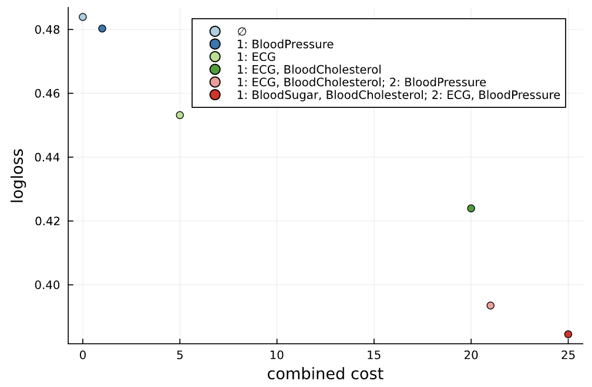

  
  

_______

A decision-making framework for the cost-efficient design of experiments, balancing the value of acquired experimental evidence and incurred costs. We have considered two different experimental setups, which are outlined below.

### Static experimental designs
Here we assume that the same experimental design will be used for a population of examined entities, hence the word 'static'.

For each subset of experiments, we consider an estimate of the value of acquired information. To give an example, if a set of experiments is used to predict the value of a specific target variable, our framework can leverage a built-in integration with [MLJ.jl](https://github.com/alan-turing-institute/MLJ.jl) to estimate predictive accuracies of machine learning models fitted over subset of experimental features.

In the cost-sensitive setting of CEEDesigns, a user provides the monetary cost and execution time of each experiment. Given the constraint on the maximum number of parallel experiments along with a fixed tradeoff between monetary cost and execution time, we devise an arrangement of each subset of experiments such that the expected combined cost is minimized.

Assuming the information values and optimized experimental costs for each subset of experiments, we then generate a set of cost-efficient experimental designs.

### Generative experimental designs

We consider 'personalized' experimental designs that dynamically adjust based on the evidence gathered from the experiments. This approach is motivated by the fact that the value of information collected from an experiment generally differs across subpopulations of the entities involved in the triage process.

At the beginning of the triage process, an entity's prior data is used to project a range of cost-efficient experimental designs. Internally, while constructing these designs, we incorporate multiple-step-ahead lookups to model likely experimental outcomes and consider the subsequent decisions for each outcome. Then after choosing a specific decision policy from this set and acquiring additional experimental readouts (sampled from a generative model, hence the word 'generative'), we adjust the continuation based on this evidence.

We conceptualized the triage as a Markov decision process, in which we iteratively choose to conduct a subset of experiments and then, based on the experimental evidence, update our belief about the distribution of outcomes for the experiments that have not yet been conducted. The information value associated with the state, derived from experimental evidence, can be modeled through any statistical or information-theoretic measure such as the variance or uncertainty associated with the target variable posterior.

We implemented the following two variants of the decision-making process: Firstly, assuming that the decision-making process only terminates when the uncertainty drops below a given threshold, we minimize the expected resource spend. Secondly, we can optimize the value of experimental evidence, adjusted for the incurred experimental costs.

## Context: Dynamics of Value Evolution (DyVE)
 
The package is an integral part of the **Dynamics of Value Evolution (DyVE)** computational framework for learning, designing, integrating, simulating, and optimizing R&D process models, to better inform strategic decisions in science and business.
 
As the framework evolves, multiple functionalities have matured enough to become standalone packages.

This includes **[ReactiveDynamics.jl](https://github.com/Merck/ReactiveDynamics.jl)**, a package which implements a category of reaction (transportation) network-type dynamical systems. The central concept of the package is of a stateful, parametric transition; simultaneous action of the transitions then evolves the dynamical system. Moreover, a network's dynamics can be specified using a compact modeling metalanguage.

Another package is **[AlgebraicAgents.jl](https://github.com/Merck/AlgebraicAgents.jl)**, a lightweight package to enable hierarchical, heterogeneous dynamical systems co-integration. It implements a highly scalable, fully customizable interface featuring sums and compositions of dynamical systems. In present context, we note it can be used to co-integrate a reaction network problem with, e.g., a stochastic ordinary differential problem!